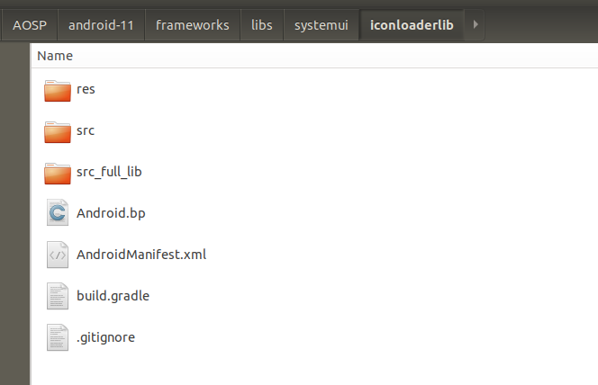
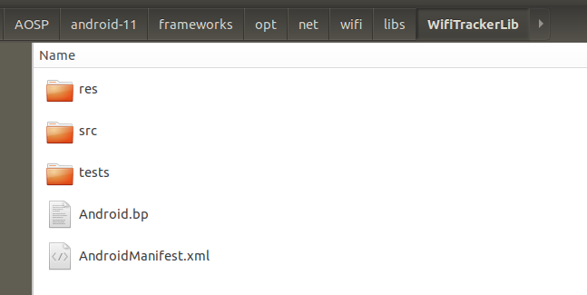
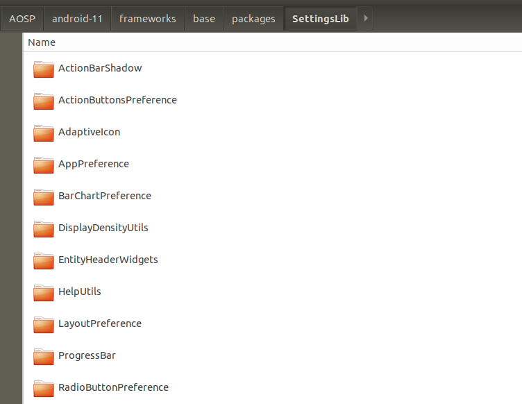

## SystemUI from android-11.0.0_r10
### SystemUI脱离源码在Android Studiod的编译

### 支持说明
* 不试图改变项目本身的目录结构
* 通过添加额外的配置和依赖构建Gradle环境支持
* 会使用脚本移除一些AS不支持的属性和字段，然后利用git本地忽略
* 运行的效果会与原生的还是有些许差异，这是由于脱离源码之后，引用private属性失败所导致的样式差异（如下图）


###  pixel2运行效果：Gradle编译 VS Android.bp编译
---
 

---


## 执行步骤
#### 第一步：运行在Filter上的主函数，执行过滤任务


### 第二步：执行Android Studio上Build APK的操作, 然后将apk推送到设备上SystemUI所在的目录

```
adb push SystemUI.apk /system/system_ext/priv-app/SystemUI/

adb shell killall com.android.systemui
```
######  如果SystemUI不能正常起来，则需要重启一下设备
```
adb reboot
```


## 构建步骤

### Step1：引入静态依赖
##### @framework.jar:
```
// AOSP/android-11/out/target/common/obj/JAVA_LIBRARIES/framework_intermediates/classes-header.jar
compileOnly files('libs/framework.jar')
```


##### @core-all.jar:
```
// AOSP/android-11/out/soong/.intermediates/libcore/core-all/android_common/javac/core-all.jar
compileOnly files('libs/core-all.jar')
```


##### @preference-1.2.0-alpha01.aar:
```
// AOSP/android-11/prebuilts/sdk/current/androidx/m2repository/androidx/preference/preference/1.2.0-alpha01/preference-1.2.0-alpha01.aar
implementation(name: 'preference-1.2.0-alpha01', ext: 'aar')
```


###### ps: androidx.preference 不容易通过以下方式去引用，故换成静态
```
## implementation 'androidx.preference:preference:1.2.0-alpha01'
```

##### @iconloader_base.jar:
```
// AOSP/android-11/out/soong/.intermediates/frameworks/libs/systemui/iconloaderlib/iconloader_base/android_common/javac/iconloader_base.jar
implementation files('libs/iconloader_base.jar')
```


##### @libprotobuf-java-nano.jar:
```
// AOSP/android-11/out/soong/.intermediates/external/protobuf/libprotobuf-java-nano/android_common/javac/libprotobuf-java-nano.jar
implementation files('libs/libprotobuf-java-nano.jar')
```


##### @SystemUIPluginLib.jar:
```
// AOSP/android-11/out/soong/.intermediates/frameworks/base/packages/SystemUI/plugin/SystemUIPluginLib/android_common/javac/SystemUIPluginLib.jar
implementation files('libs/SystemUIPluginLib.jar')
```


##### @SystemUISharedLib.jar:
```
// AOSP/android-11/out/soong/.intermediates/frameworks/base/packages/SystemUI/shared/SystemUISharedLib/android_common/javac/SystemUISharedLib.jar
implementation files('libs/SystemUISharedLib.jar')
```


##### @WindowManager-Shell.jar:
```
// AOSP/android-11/out/soong/.intermediates/frameworks/base/libs/WindowManager/Shell/WindowManager-Shell/android_common/javac/WindowManager-Shell.jar
implementation files('libs/WindowManager-Shell.jar')
```


##### @SystemUI-tags.jar:
```
// AOSP/android-11/out/soong/.intermediates/frameworks/base/packages/SystemUI/SystemUI-tags/android_common/javac/SystemUI-tags.jar
implementation files('libs/SystemUI-tags.jar')
```


##### @SystemUI-proto.jar:
```
// AOSP/android-11/out/soong/.intermediates/frameworks/base/packages/SystemUI/SystemUI-proto/android_common/javac/SystemUI-proto.jar
implementation files('libs/SystemUI-proto.jar')
```


##### @SystemUI-statsd.jar:
```
// AOSP/android-11/out/soong/.intermediates/frameworks/base/packages/SystemUI/shared/SystemUI-statsd/android_common/javac/SystemUI-statsd.jar
implementation files('libs/SystemUI-statsd.jar')
```


### Step2：引入Module
###### 将具体路径下的代码直接导入到项目中作为Module依赖, 构建的时候可以直接通过implementation project引用，或者也可以gradle build生成aar,再放置到libs文件夹中，作为静态包使用。

##### @iconloaderlib: 
```
// AOSP/android-11/frameworks/libs/systemui/iconloaderlib
implementation project(':iconloaderlib')
```



##### @WifiTrackerLib: 
```
// AOSP/android-11/frameworks/opt/net/wifi/libs/WifiTrackerLib
implementation project(':WifiTrackerLib')
```



##### @SettingsLib: 
```
// AOSP/android-11/frameworks/base/packages/SettingsLib
implementation project(':SettingsLib:RestrictedLockUtils')
implementation project(':SettingsLib:AdaptiveIcon')
implementation project(':SettingsLib:HelpUtils')
implementation project(':SettingsLib:ActionBarShadow')
implementation project(':SettingsLib:AppPreference')
implementation project(':SettingsLib:SearchWidget')
implementation project(':SettingsLib:SettingsSpinner')
implementation project(':SettingsLib:LayoutPreference')
implementation project(':SettingsLib:ActionButtonsPreference')
implementation project(':SettingsLib:EntityHeaderWidgets')
implementation project(':SettingsLib:BarChartPreference')
implementation project(':SettingsLib:ProgressBar')
implementation project(':SettingsLib:RadioButtonPreference')
implementation project(':SettingsLib:DisplayDensityUtils')
implementation project(':SettingsLib:Utils')
```


## 生成platform.keystore默认签名

在AOSP/android-11/build/target/product/security路径下找到签名证书，并使用 [keytool-importkeypair](https://github.com/getfatday/keytool-importkeypair) 生成keystore,
执行如下命令：  

```
./keytool-importkeypair -k platform.keystore -p 123456 -pk8 platform.pk8 -cert platform.x509.pem -alias platform
```

并将以下代码添加到gradle配置中：

```
    signingConfigs {
        platform {
            storeFile file("platform.keystore")
            storePassword '123456'
            keyAlias 'platform'
            keyPassword '123456'
        }
    }

    buildTypes {
        release {
            debuggable false
            minifyEnabled false
            signingConfig signingConfigs.platform
        }

        debug {
            debuggable true
            minifyEnabled false
            signingConfig signingConfigs.platform
        }
    }
```

### PS:
##### 查看被忽略的文件列表
```
git ls-files -v | grep '^h\ '
```  

##### 忽略和还原单个文件
``` 
git update-index --assume-unchanged $path
git update-index --no-assume-unchanged $path
``` 

##### 还原全部被忽略的文件
```
git ls-files -v | grep '^h' | awk '{print $2}' |xargs git update-index --no-assume-unchanged 
```

---

### 关联项目
* [Settings](https://github.com/siren-ocean/Settings)
* [Launcher3](https://github.com/siren-ocean/Launcher3)
* [DocumentsUI](https://github.com/siren-ocean/DocumentsUI)
* [Camera2](https://github.com/siren-ocean/Camera2)
